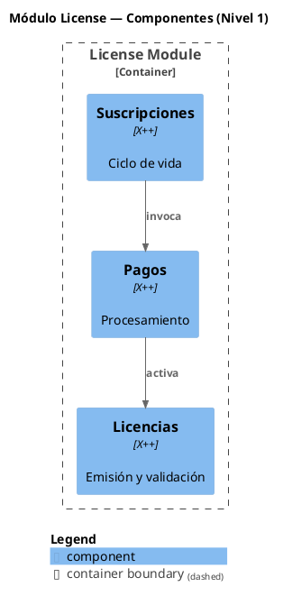

# C4-PlantUML Usage — plugin `document-xpp`

Referencia de sintaxis para generar diagramas C4 con la librería `plantuml-stdlib/C4-PlantUML`. El agente `c4-component-writer` (Fase 5) usa esta referencia como contrato.

---

## Inclusión de la librería

```plantuml
!include <C4/C4_Component.puml>
```

Esta línea reemplaza el `skinparam class { ... }` que usa `uml-diagram-writer`. No hace falta declarar nada más — la librería expone todos los macros.

---

## Macros principales

### `Component` — componente interno del sistema

```plantuml
Component(alias, "Label", "Technology", "Description")
```

| Parámetro | Descripción |
|---|---|
| `alias` | Identificador interno (snake_case, sin espacios) |
| `Label` | Nombre visible en el diagrama |
| `Technology` | Stack/lenguaje — siempre `"X++"` para componentes D365 |
| `Description` | Una línea de descripción funcional |

**Ejemplo:**
```plantuml
Component(svc_subscription, "Gestión de Suscripciones", "X++", "Ciclo de vida: creación, renovación, cancelación")
```

---

### `Component_Ext` — componente externo al boundary

```plantuml
Component_Ext(alias, "Label", "Technology", "Description")
```

Igual que `Component` pero con borde punteado. Usar para grupos de otras funcionalidades que se referencian desde el grupo actual (`external_refs[].in_inventory: true`).

---

### `Container_Boundary` — boundary que agrupa componentes

```plantuml
Container_Boundary(alias, "Label") {
    Component(...)
    Component(...)
}
```

Usar para encerrar todos los componentes del módulo en el **Nivel 1** o todos los sub-componentes del grupo en el **Nivel 2**.

---

### `Rel` — relación entre componentes

```plantuml
Rel(from_alias, to_alias, "Label")
Rel(from_alias, to_alias, "Label", "Technology")
```

El `Label` describe la interacción en lenguaje del dominio (ej: `"orquesta"`, `"persiste"`). No hay catálogo formal separado para C4 — usá el mismo vocabulario que `visual-conventions.md` (verbos semánticos).

**Ejemplo:**
```plantuml
Rel(svc_subscription, svc_payments, "invoca")
```

---

### `SHOW_LEGEND()` — leyenda automática

```plantuml
SHOW_LEGEND()
```

Genera una leyenda automática con los colores de los elementos presentes. **Obligatorio** en todos los `.puml` C4 generados por el plugin — equivalente al `legend right` de UML.

---

## Estructura mínima de un .puml C4



---

## Diferencias clave respecto al UML de clases

| Aspecto | `uml-diagram-writer` (Fase 3) | `c4-component-writer` (Fase 5) |
|---|---|---|
| Librería | `skinparam class { ... }` nativo | `!include <C4/C4_Component.puml>` |
| Elemento base | `class Foo <<Stereotype>>` | `Component(alias, "Label", "X++", "Desc")` |
| Granularidad | Clase individual con métodos/fields | Grupo funcional o cluster semántico |
| Leyenda | `legend right ... end legend` | `SHOW_LEGEND()` |
| Relaciones | `A --> B : verbo` | `Rel(a, b, "verbo")` |
| Externos | `class Foo <<External>>` | `Component_Ext(alias, "Label", "X++", "")` |

---

## Qué NO hacer

- **No uses `!theme`** — la librería C4-PlantUML ya define estilos consistentes.
- **No repitas `!include`** en el mismo archivo — una sola línea de include al tope.
- **No uses macros de `C4_Container.puml` ni `C4_Context.puml`** — este plugin sólo usa `C4_Component.puml`.
- **No inventés macros** que no estén en esta referencia. Si necesitás algo nuevo, registralo en `warnings[]` del contrato del agente.
