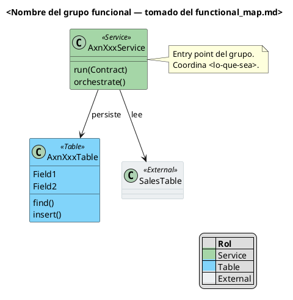

# Visual Conventions — Diagramas del plugin `document-xpp`

Reglas de estilo para que los diagramas PlantUML generados por el plugin (M2+) sean **consistentes entre corridas**, **legibles al primer vistazo** y **útiles como documentación viva**.

El agente `diagram-writer` (M2+) consume este archivo como contrato. Las reglas marcadas **obligatorio** son output-gating; las **recomendado** son defaults que se pueden overridear si queda justificado.

---

## Principios

1. **El diagrama cuenta el dominio, no el encapsulamiento.** Si alguien quiere saber la visibilidad de un método, lee el código. El diagrama responde *"¿cómo se organiza este pedazo del sistema?"*
2. **Un diagrama = una funcionalidad.** Cada grupo del `functional_map.md` produce un `.puml`. Si la complejidad rompe 15 clases, se divide en sub-views.
3. **Leyenda siempre visible.** Un diagrama sin leyenda no es autodocumentable.
4. **Vocabulario cerrado en las relaciones.** Los verbos salen del catálogo — sin improvisación por diagrama.

---

## Paleta por rol

Los roles salen del classifier (`agents/functional-classifier.md`): `service`, `entity`, `controller`, `dto`, `helper`, `other`. Se extienden con estereotipos específicos de X++: `Table`, `Enum`, `EDT`, `Interface`, `External`.

**Aplicación obligatoria:** vía `skinparam class` global, NO per-clase. El agente escribe sólo el stereotype; PlantUML pinta el color.

```
skinparam class {
  BackgroundColor<<Service>>     #A5D6A7
  BackgroundColor<<Controller>>  #FFCC80
  BackgroundColor<<Table>>       #81D4FA
  BackgroundColor<<Entity>>      #81D4FA
  BackgroundColor<<Contract>>    #FFF59D
  BackgroundColor<<DTO>>         #FFF59D
  BackgroundColor<<Helper>>      #CFD8DC
  BackgroundColor<<EDT>>         #FCE4EC
  BackgroundColor<<External>>    #ECEFF1
  BorderColor<<External>>        #B0BEC5
  BorderStyle<<External>>        dashed
}
skinparam enum {
  BackgroundColor #F8BBD0
}
```

| Rol / Stereotype  | Color    | Semántica |
|---|---|---|
| `<<Service>>`     | verde medio `#A5D6A7` | Lógica activa, orquestación |
| `<<Controller>>`  | naranja claro `#FFCC80` | Entry point (UI, batch, web) |
| `<<Table>>` / `<<Entity>>` | celeste `#81D4FA` | Persistencia — tabla X++ o entidad de dominio |
| `<<Contract>>` / `<<DTO>>` | amarillo suave `#FFF59D` | Data carriers — request/response/DataContract |
| `<<Helper>>`      | gris frío `#CFD8DC` | Utilidades sin estado |
| `<<Interface>>`   | *default PlantUML* | Contrato de API — se distingue por shape, no por color |
| `<<Enum>>`        | rosa claro `#F8BBD0` | Value sets (desde `AxEnum/*.xml`) |
| `<<EDT>>`         | rosa pálido `#FCE4EC` | Extended Data Types (desde `AxEdt/*.xml`) |
| `<<External>>`    | gris muy claro `#ECEFF1`, borde punteado | Framework D365, .NET interop, cualquier clase fuera del `inventory.csv` |

**Obligatorio:** toda clase del diagrama lleva exactamente UN stereotype de esta tabla.

**Recomendado:** si una clase calza en dos roles (p.ej. `*Service` con mucha UI), el `role` del YAML de tracking es la fuente de verdad.

---

## Modificadores de acceso — **NO incluir**

Prohibido usar `+`, `-`, `#`, `~` delante de métodos o campos.

**Razón:** el diagrama comunica arquitectura de dominio, no encapsulamiento. Si un miembro no aporta señal para entender el grupo funcional, **se omite del diagrama directamente**. El código es la fuente autoritativa para visibility.

**Regla práctica:** antes de agregar un método privado, preguntate si un lector externo necesita saber que existe para entender la funcionalidad. Si la respuesta es no, no lo dibujes.

```
# MAL
class AxnLicSubscriptionService {
  -subscriptionContract: AxnLicSubscriptionRequestContract
  +run(AxnLicSubscriptionRequestContract)
  -buildHttpContractForToken(str): AxnLicHttpCallContract
}

# BIEN
class AxnLicSubscriptionService <<Service>> {
  run(AxnLicSubscriptionRequestContract)
  buildHttpContractForToken() : AxnLicHttpCallContract
  getSubscriptions(AxnLicHttpCallContract)
  saveSubscriptions()
}
```

---

## Tipos en signaturas

| Tipo | Mostrar |
|---|---|
| Otra clase del mismo diagrama | ✅ sí — genera arrow implícito |
| Otra clase externa (`SalesTable`, `HttpResponseMessage`) | ✅ sí si aporta señal (integración, límite del dominio) |
| Primitivos X++ (`str`, `int`, `boolean`, `date`, `utcdatetime`, `real`) | ❌ no — ruido visual |
| Colecciones con tipos de dominio (`List` de `AxnLicExtension`) | ✅ sí |
| `void` o sin retorno | ❌ no — implícito |

---

## Verbos semánticos para relaciones

**Catálogo cerrado.** Cada relación lleva un verbo del catálogo como label — nada de prosa libre.

| Verbo | Semántica | Uso típico |
|---|---|---|
| `usa` | dependencia estructural sin dinámica clara | `Service --> Contract : usa` |
| `invoca` | llamada sincrónica puntual | `Controller --> Service : invoca` |
| `orquesta` | coordina varias unidades | `Service --> [varios] : orquesta` |
| `crea` | instancia | `Service --> DTO : crea` |
| `persiste` | escribe estado | `Service --> Table : persiste` |
| `lee` | lectura sólo | `Controller --> Parameters : lee` |
| `valida` | chequeo de invariantes | `Service --> Contract : valida` |
| `transforma` | mapea de un shape a otro | `Service --> ResponseContract : transforma` |
| `notifica` | evento saliente | `Service --> Handler : notifica` |
| `autentica` | flujo de auth | `HttpService --> AuthProvider : autentica` |
| `consume` | entrada de datos externa | `HttpService --> HttpContract : consume` |
| `contiene` | composición (vida compartida) | `Parent *-- Child : contiene` |
| `pertenece a` | agregación (vidas independientes) | `Child o-- Parent : pertenece a` |
| `extiende` | herencia — **sin label**, la flecha `--\|>` es autodescriptiva | — |
| `implementa` | realización — **sin label**, la flecha `..\|>` es autodescriptiva | — |

**Obligatorio:** todas las asociaciones (`-->`, `..>`) llevan un verbo del catálogo como label.

**Añadir verbos al catálogo:** si detectás una relación que no encaja, proponelo como extensión del catálogo (PR a este archivo) — no inventes en el diagrama.

---

## Tipos de relación UML

| Sintaxis | Significado | Ejemplo |
|---|---|---|
| `A --> B : <verbo>` | asociación (A depende de B en runtime) | `Service --> Table : persiste` |
| `A *-- B : contiene` | composición (B vive y muere con A) | `ResponseContract *-- DetailContract : contiene` |
| `A o-- B : pertenece a` | agregación (B existe independiente) | `Extension o-- Subscription : pertenece a` |
| `A --\|> B` | herencia | `Controller --\|> SysOperationServiceController` |
| `A ..\|> B` | implementación de interfaz | `HttpClient ..\|> IHttpClient` |
| `A ..> B : <verbo>` | dependencia débil (solo referenciado, no poseído) | `Helper ..> ExternalAPI : invoca` |

---

## Agrupamiento con `package`

Usar `package` cuando:
- Hay más de 10 clases en el diagrama y se pueden clusterizar por sub-área (Tables, Contracts, Http).
- Hay clases "de apoyo" (Contracts, DTOs) que conceptualmente viven aparte de las de negocio.

**NO usar** `package` como sustituto de layout — el layout se controla con `together`, `direction`, etc.

Nomenclatura: sustantivo corto en Title Case. Ej: `Tables`, `Contracts`, `Http`, `Events`.

---

## Notas (`note`)

**Uso parco:** máximo 2 `note` por diagrama.

Justificación obligatoria para incluir una nota:
- Marcar el **entry point** del flujo.
- Explicar una **asimetría no obvia** (p.ej. "esta tabla se persiste desde el Controller, no desde el Service").
- Flagear un **gotcha** (p.ej. "la interface tiene dos implementaciones, sólo se dibuja la principal por claridad").

**NO usar nota para** repetir lo que el stereotype + color ya comunican.

---

## Leyenda — **obligatoria**

Toda salida `.puml` cierra con una leyenda. Formato fijo:

```
legend right
  |= Color                      |= Rol |
  |<back:#A5D6A7>            </back>| Service |
  |<back:#FFCC80>            </back>| Controller |
  |<back:#81D4FA>            </back>| Table / Entity |
  |<back:#FFF59D>            </back>| Contract / DTO |
  |<back:#CFD8DC>            </back>| Helper |
  |<back:#F8BBD0>            </back>| Enum |
  |<back:#FCE4EC>            </back>| EDT |
  |<back:#ECEFF1>            </back>| External |
end legend
```

**Regla:** incluir sólo las filas de los roles que **efectivamente aparecen** en el diagrama. La leyenda explica lo que el lector ESTÁ VIENDO, no un catálogo completo.

---

## Layout y tamaño

- **Default:** `top to bottom direction`. Cambiar a `left to right direction` si el flujo es claramente horizontal (Controller → Service → HttpService → External).
- **Tamaño objetivo:** 5–15 clases por diagrama.
  - < 5 clases → probablemente el grupo funcional es demasiado fino; considerar fusionar con otro grupo.
  - \> 15 clases → dividir en sub-views: `<slug>-<subview>.puml`.
- **Forzar agrupamientos visuales:** `together { Service, Controller }` evita que PlantUML los separe.

---

## Archivo y nombres

- Path: `<workspace>/diagrams/classes/<slug>.puml` donde `<slug>` es el slug del YAML de funcionalidad.
- Sub-view: `<slug>-<subview>.puml` con `<subview>` en kebab-case ASCII.
- Extensión: `.puml` (no `.wsd`, no `.pu`) — estandarizada en `tracking-schema.md`.

---

## Template base

Skeleton que el agente `diagram-writer` (M2+) rellena. Mantener los bloques en este orden.



---

## Gaps del sample original

Este archivo se derivó de `PlantUML-sample-license-services.wsd` (raíz del repo, borrador aportado por el usuario). Resumen de divergencias:

| Decisión | Sample | Convención aquí |
|---|---|---|
| Modificadores de acceso | Incluidos (`+`/`-`) | **Omitidos** |
| Definición de colores | `!define` per-clase | `skinparam class` global |
| Reuso de color | `SERVICE_COLOR` = `TABLE_COLOR` = `#lightgreen` (colisión) | Paleta sin colisiones |
| Aplicación de stereotype | Parcial (sólo `<<Table>>`) | Obligatoria para todas las clases |
| Tipos en signaturas | Primitivos incluidos | Primitivos omitidos |
| `<<External>>` | Ausente | Obligatorio para out-of-domain |
| Leyenda | Ausente | Obligatoria |
| Catálogo de verbos | Libre (ad-hoc por diagrama) | Cerrado |
| Tamaño del diagrama | Sin criterio | Target 5–15 clases |

---

## Protocolo de evolución

Si durante M2+ surge la necesidad de:
- Un nuevo **rol / stereotype** → PR que actualice la tabla de paleta + leyenda.
- Un nuevo **verbo** → agregarlo al catálogo con su semántica en una fila.
- Un **cambio de color** → PR con captura antes/después y justificación (accesibilidad, contraste, daltonismo).

**No driftear** en diagramas individuales: si el agente detecta necesidad de algo no documentado, lo escala como `warnings[]` en el output JSON del contrato del classifier / diagram-writer.
